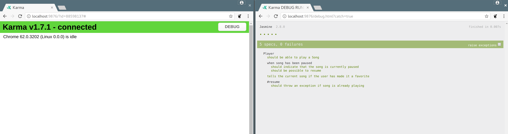

# How to Use

The default [jasmine 2.8.0 bundle](https://github.com/jasmine/jasmine/releases/download/v2.8.0/jasmine-standalone-2.8.0.zip) can be found in the [latest jasmine release](https://github.com/jasmine/jasmine/releases)

You can open up the SpecRunner.html run the default test cases with a static library, and you can refresh the apps 

# How to Use with Karma

`yarn test:watch` will run your tests inside of Chrome, and automatically run your tests in reaction to changes.

You can activate a better ui dump with the following setup by clicking the `Debug` button on the top of the chrome browser.

